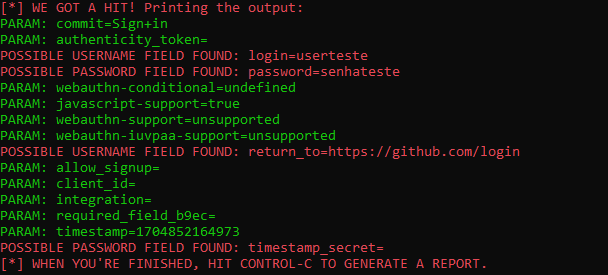

## Esse foi um desafio realizado na DIO, nele o objetivo é criar um phishing utilizando o setoolkit, nas opções de clone de site.

## Fiz um clone da pagina de login do GitHub

### Ferramentas

- Kali Linux
- setoolkit

### Configurando o Phishing no Kali Linux

- Acesso root: ``` sudo su ```
- Iniciando o setoolkit: ``` setoolkit ```
- Tipo de ataque: ``` Social-Engineering Attacks ```
- Vetor de ataque: ``` Web Site Attack Vectors ```
- Método de ataque: ```Credential Harvester Attack Method ```
- Método de ataque: ``` Site Cloner ```
- URL para clone: https://github.com/login

### Resutados


